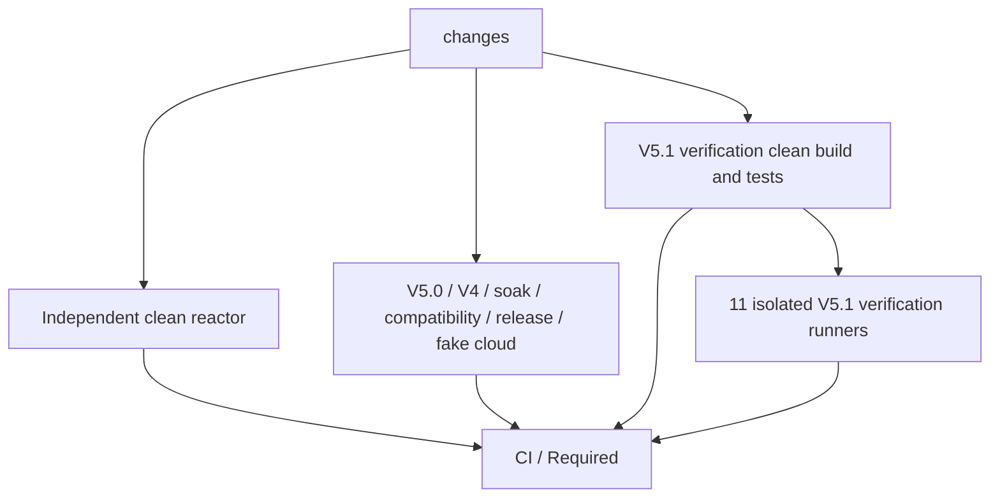

# V5.1 verification build domain

## Scope and decision

The CI audit found eleven V5.1 jobs repeating the same prerequisite reactor build
and tests. Share that prerequisite **within V5.1 verification only**. This is the
first of two migrations: keep the complete rich-workload qualification unchanged
until CI has exercised artifact production and restoration. Its later sharding
requires a separate cross-shard evidence validator, described below.

This document integrates the root refactor request. Do not share a universal
workspace, treat Maven caches as build evidence, weaken test prerequisites, reduce
frozen workloads, or change release/reproducibility/paid-cloud acceptance.

## First-migration dependency audit

| Domain/job | Prerequisite and decision |
| --- | --- |
| `changes` | Standard-library change/topology/bundle/retry tests; docs-only contracts; no Java build |
| `reactor-core` | Independent `clean package`, including all reactor tests; keep the `Reactor tests` cloud-preflight name |
| `v51-verification-build` | A second, dedicated `clean package` with all reactor tests; publish only V5.1 verifier inputs |
| Eleven V5.1 behavioral lanes | Restore the exact-source bundle; retain all 26 existing `--skip-build` commands and per-gate evidence |
| `v50-authority`, `v50-recovery-workload` | Keep each existing reactor package/tests and V5.0 control/evidence dependencies |
| `v4-regression` | Keep core builds, JMH ordering and the final non-JMH clean rebuild |
| `soak-examples` | Keep JMH test profile, end-to-end script builds and example integration |
| `compatibility` | Keep clean API compatibility, isolated Maven repository and separately compiled consumers |
| `release-artifacts` | Keep clean release-profile verify, sources/Javadoc checks and independent reproducibility builds |
| `cloud-runner-tests` | Keep Python/shell/fake-cloud checks independent; no bundle, Java or paid resource |
| `required` | Check the build producer and every behavioral/independent gate; unexpected skip/failure/cancellation fails |

In that first migration, docs-only classification skipped all twenty full-CI gates.
The [second migration](CI_V51_RICH_SHARDS.md) adds prepared-input and matrix results
to the required set. `Required` still runs and
requires exactly `skipped` for those gates. For full CI a producer failure skips
its consumers and fails `Required`; it cannot become a successful empty run.
The protected-check name, workflow triggers, permissions and concurrency stay unchanged.

## Bundle contract

The producer uses the same pinned Temurin JDK as the consumers. `prepare` records
checkout SHA, a content/executable-bit fingerprint of tracked and nonignored files,
Java vendor/runtime and a build-start time outside `target/`. A successful clean
reactor package executes prerequisites, then `create` checks unchanged source and
Java identity, fresh JAR/report timestamps and successful executed Java suites.
All reactor Surefire reports and all infrastructure attempts are uploaded with
`always()`, including failed builds. No test result is replaced by a compilation.

`v51-verification-build-${{ github.sha }}` contains deterministic `build.tar.gz`
and `manifest.json`. The same-run exact artifact is selected explicitly; a branch
cache, previous run or wildcard artifact is never used. The SHA is the checked-out
GitHub SHA, including the synthetic merge SHA in pull-request CI.

The exhaustive payload allowlist is:

1. Core main JAR at `target/general-search-engine-<version>.jar`.
2. Replication main JAR at `general-search-engine-replication/target/general-search-engine-replication-<version>.jar`.
3. Replication `target/test-classes/`, including worker classes/resources.
4. Replication `target/surefire-reports/`, including executed prerequisite XML.

The audit covered every V5.1 shell gate and its Python/Java launch paths. Storage,
protocol, runtime and recovery workers use the replication test classes; public
consumers compile from checked-out `scripts/v51/java` against the main JARs.
Storage/protocol/runtime/rejoin/bootstrap/public runtime/final/hardening validators
also read executed Java reports. Core classes, processor/example outputs, `.m2`,
other target directories and existing experiment evidence are not runtime inputs.
Published V4.4/V5.0 controls remain independently resolved and checksum-pinned.

Restoration validates source and Java identity, layout, archive SHA-256, every
file's size/hash, exact membership and successful prerequisite reports before
writing outputs. It rejects missing/extra/duplicate members, links, traversal,
oversized payloads and existing output roots. Archives have sorted names and fixed
metadata; they are verification inputs, not canonical release artifacts.

A consumer checkout happens later than the producer build. Existing harnesses use
JAR/report modification times to reject stale local builds. After content validation,
restoration rebases output timestamps to at least the newest checkout timestamp;
JAR/XML bytes are unchanged. The per-lane always-uploaded restore receipt records
source, Java, manifest/archive hashes, file count, byte counts, time and the rebased
timestamp. No mtime guard or evidence validator is removed.

## Rich-workload sharding: second migration

The five complete cells are independently runnable: each owns its ports, process
group, leader/bootstrap, trace/command history and final shutdown/restore. They
share only an immutable prepared source, frozen plans, adapter identities and
published controls. A healthy cell's warmup and all measurement windows must run
continuously with the same state/processes; never split those windows across jobs.

The three-shard layout is:

| Shard | Complete cells | Frozen window time |
| --- | --- | ---: |
| Published controls | V4.4 healthy + configured V5.0 healthy | 520 s (including two warmups) |
| Automatic healthy | Automatic V5.1 healthy | 260 s (including warmup) |
| Automatic concurrent | Automatic read-heavy + sustained | 300 s |

The [second migration implementation](CI_V51_RICH_SHARDS.md) follows these boundaries.
It implements partial-shard receipts that cannot claim full
qualification, unique SHA/shard artifacts, fail-fast disabled, and a required
aggregate validator. The aggregate must reconstruct exactly the original five
cells/order; require common source inventory, plans, JAR/class hashes and control
pins; enforce the **combined** trace/evidence budget; run the read-heavy evidence
negatives and relocated binary validation; and reject missing, duplicate, stale
or incompatible shards. Do not compare monotonic timestamps between runners.
The existing full validator intentionally rejects partial runs; `--only` plus
three jobs without aggregation is insufficient.

Keep the 1080 seconds of total frozen windows, per-cell deadlines, workload rates,
counts, durability/history oracles and cleanup ownership unchanged. The theoretical
window-only critical path becomes 520 seconds, at the cost of one shared source preparation, per-shard adapter preparation
and artifact aggregation. This is a window-only estimate; hosted measurements of the second migration remain pending.

## Measurement and acceptance

Baseline: successful master [CI 35989431966](https://github.com/patricklfdm/GeneralSearchEngine/actions/runs/35989431966),
source `22328ed4dc358e0adc7fde1399528295ebf8d2a3`. Measurements and local restore
receipts are retained under `target/ci-v51-build-refactor/` during development.
Protected master CI 36002482606 passed after the first migration; its measurements
are recorded in [the second migration](CI_V51_RICH_SHARDS.md). Track queue time, producer build/test time, upload,
consumer download/restore, gate time and total runner minutes separately.

Local acceptance checks cover bundle corruption/provenance/layout/freshness,
Required outcomes, job topology, unchanged gate/upload steps and independent clean
builds. Build in an isolated checkout, restore into another fresh checkout, and
exercise the original `--skip-build` entry points with only the allowlisted output
tree. Existing local `target/` or Maven output must not hide missing bundle inputs.
A successful shared prerequisite is build/test evidence; each lane still creates
its own fresh execution evidence. No cloud qualification or release status changes.

### Before/after accounting

| Metric | Measured before | After this migration |
| --- | ---: | ---: |
| V5.1 prerequisite reactor builds with tests | 11 | 1 |
| Direct ordinary reactor package steps (including independent core and V5.0) | 14 | 4 |
| Wrapped ordinary Maven steps, including two V4 steps | 16 | 6 |
| V5.1 repeated build time | 3253 s total; 257–316 s each | One build; 317 s Maven in CI 36002482606 |
| Full workflow sum of job execution times | 11080 s (184.7 runner minutes; excludes queueing) | 8147 s (135.8 runner minutes) |
| Longest V5.1 job: remote-rich | 1734 s (28m54s), including 301 s build | 331 s producer; rich job 1293 s, including 1266 s qualification |

Using the observed mean build of 295.7 seconds, deduplicating ten builds saves
about **49.3 runner minutes before artifact/setup overhead**. This is an estimate,
not a billable-cost prediction. The dedicated producer also runs checkout/setup,
uploads the bundle, and consumers download it; their unchanged verification work
starts later in the job graph. Stage one may add latency to the remote-rich critical
path even while substantially reducing total runner work. It does not claim to
shorten the frozen workload or the whole workflow.

The release-profile verify, nested compatibility/consumer builds, two-workspace
reproducibility checks and script-owned special builds are excluded from the
ordinary-build counts and remain unchanged. A `.m2` dependency cache may speed the
producer; it cannot replace the bundle or the execution reports.

### Migration risks and follow-up

- A missing payload input causes restoration or its consumer to fail; require the
  first exact-source protected CI before accepting migration performance claims.
- Source/Java/file hashes and a fresh clean-build marker prevent accidental stale
  artifact reuse. Same-run immutable artifacts are the trust boundary; the bundle
  is not a signature system or a published release attestation.
- Rerunning failed consumers uses the same run's retained bundle. Once its fourteen-day
  retention expires, rerun the full workflow to rebuild the prerequisite.
- One failed prerequisite build blocks all V5.1 consumers. Its shared Java reports
  and attempt logs are retained once, while behavioral failures retain their own
  evidence and the exact bundle identity for diagnosis.
- `Required` explicitly includes the producer and all consumers. Existing cloud
  preflight display names and the V5.0 failure/volume-probe step name are preserved.
- Sharding introduces independent process ownership, aggregate evidence budgets
  and missing-shard failure modes. Land and measure this build migration before
  implementing the three-shard/aggregate contract; retain full qualification until
  that contract passes negative tests and complete portable replay.

## Changed files

| File | Purpose |
| --- | --- |
| `.github/workflows/ci.yml` | Dedicated producer, eleven restores, retained diagnostics and Required dependency |
| `scripts/ci_v51_bundle.py` | Standard-library bundle/source/toolchain integrity and freshness checks |
| `scripts/test_ci_v51_bundle.py` | Determinism, corruption, source/Java drift, unsafe/missing/duplicate paths, prerequisites and failure receipts |
| `scripts/test_ci_changes.py` | Docs-only/full-CI outcomes, build-domain topology and approved Maven invocation counts |
| `docs/CI_V51_BUILD_DOMAIN.md` | This audit, contract, measurements and next migration requirements |
| `docs/CI_CD.md` | Current CI architecture and artifact ownership |
| `docs/CI_V51_LANES.md` | Updated V5.1 prerequisite ownership with historical timing estimates labelled |
| `docs/CI_MAVEN_INFRA_RETRY.md` | Current six wrapped steps in five build jobs; classification unchanged |
| `docs/CI_PARALLEL_LANES.md` | Label pre-sharing topology as historical and link to the current design |

The original root `refactor.txt` is removed after integrating its development
requirements here. Production Java, POMs, harnesses, frozen plans and validators
are unchanged.

## Local validation record

Validation uses a separate producer checkout and eleven initially empty consumer
checkouts. The recorded checkout SHA is the baseline above plus the working-tree
fingerprint in the manifest; protected CI must still qualify the committed source.
The local Temurin runtime is `21.0.12+8-LTS`.

- `scripts/run-maven-with-infra-retry.sh ./mvnw -f reactor/pom.xml clean package`:
  899 Java tests, four existing skips, no failures/errors; local build 6m54s.
- `python3 -m unittest scripts.test_ci_changes scripts.test_ci_v51_bundle
  scripts.test_maven_infra_retry scripts.v44.test_phase7_release_fixtures`:
  62 tests passed, including every Required outcome and malformed/stale bundles.
- Six V5.0 cloud setup/runner/cleanup/failure/remote test modules: 117 tests passed.
- Actual creation/restoration: 285 files, 1,921,337 compressed bytes,
  4,495,850 payload bytes; all eleven consumers validated the same manifest/archive.
  Local restore elapsed time was 0.121–0.275 seconds, excluding network download.
- All 123 shell blocks passed `bash -n`; YAML, 60 unique upload names, unchanged
  independent jobs, and the 26 original verification/upload pairs were checked.
- V5.0/V5.1 documentation contracts, changed local links and whitespace passed.

The first local matrix ran four isolated directories concurrently on one machine.
Ten jobs and 25 verification entry points passed. Remote-rich failed during the
automatic healthy `instrumented-b` window: an UPDATE succeeded in 1009.17 ms,
so the following one-second arrival was rejected as `LANE_BUSY`. The raw failure
is retained. This is a frozen schedule failure, not a missing or corrupt bundle;
resource contention is a hypothesis, not an established root cause.

One full rich-workload repeat ran after all other local harnesses exited, using a
new restored directory, identical bundle and unchanged frozen parameters. It passed
in **1307.483 seconds (21m47s)**: 1080 calls, ten evidence negatives and all five
cells revalidated from the relocated binary collection. Thus all 26 original
verification entry points have successful restored-input executions; the first
matrix's schedule failure remains recorded rather than being replaced by the repeat.

The result, portable receipt, original failure and log/hash index are retained at
`target/ci-v51-build-refactor/validation-summary.json`. The implementation/workflow
used by these runs match the final code; later changes only add tests/documentation.
This migration does not add automatic correctness retries or claim to fix workload
timing variability. Local concurrent-lane timings are not hosted runner measurements.

## Subsequent protected CI and rich sharding

PR #226 passed exact-master CI `36002482606` at
`0d8b18d6215be01e731afc4fae73894991ac64b3`. All producer/consumer restores and gates
passed. See [measured build results and rich-shard migration](CI_V51_RICH_SHARDS.md)
for the next topology; the earlier migration record above is retained.
