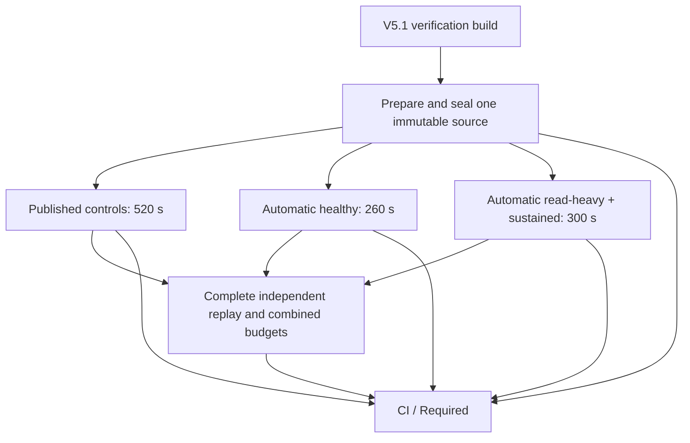

# V5.1 complete rich workload across three CI shards

## Accepted build-domain baseline

PR #226 merged at `0d8b18d6215be01e731afc4fae73894991ac64b3`.
[Exact-master CI 36002482606](https://github.com/patricklfdm/GeneralSearchEngine/actions/runs/36002482606)
passed every job. Its dedicated verification build took 331 seconds (317 seconds
Maven); bundle upload took one second, consumer downloads zero/one second and
restore zero/one second at GitHub's step timestamp resolution. The full rich job
still took 1293 seconds, including 1266 seconds of qualification.

The sum of job execution times changed from 11080 to 8147 seconds, a measured
reduction of 48.9 runner minutes between these two runs. This includes runner
variation and excludes queueing; it is not an isolated causal or billing estimate.
The [build-domain contract](CI_V51_BUILD_DOMAIN.md) remains unchanged.

## Execution graph and preserved workload



The preparation job compiles the same isolated adapters, checks the existing
bounded evidence writers and creates one initial V4.4 backup. Its portable input
binds the source commit/content, exact verification build manifest, retained JARs,
compiled adapter classes, frozen plans and immutable backup bytes. Each shard
verifies that input, compiles its own adapters and requires byte-identical adapter
identities. All five cells therefore start from exactly the same backup.

| Matrix shard | Complete cells | Frozen windows including warmup |
| --- | --- | ---: |
| `published-controls` | Healthy V4.4 local; healthy V5.0 configured | 520 s |
| `automatic-healthy` | Healthy V5.1 automatic | 260 s |
| `automatic-concurrent` | V5.1 read-heavy; V5.1 sustained | 300 s |

Total frozen window time remains **1080 seconds** and total calls remain **1080**.
A healthy cell keeps its warmup and all four measurement windows in the same
processes and state. Original per-cell ceilings, arrival rates, request counts,
JVM arguments, APIs, timeout/backpressure rules, process cleanup, state recovery,
physical and concurrent-read oracles remain in force. No measurement retry is added.
The new matrix has `fail-fast: false`, allowing failed siblings' evidence to be
retained without cancelling unrelated cells.

The original `scripts/verify-v51-phase6-remote-rich.sh --skip-build` still runs the
whole serial qualification for local diagnosis. Its complete-coverage validator
continues to reject partial evidence.

## Partial evidence and full acceptance

`v51-remote-rich-inputs` produces `PREPARED`; each execution shard can produce only
`PARTIAL`. Neither is a full qualification result. Every handoff contains its
receipt and hash-bound binary parts, with source/build/scope/seed identities checked
on unpack. Raw diagnostics and build restore receipts are uploaded with `always()`;
failed or interrupted runs cannot manufacture a complete portable handoff.

The existing `v51-remote-rich` ID/display name now denotes the aggregate. It explicitly
downloads each of the three exact-SHA artifact names from the same run and:

1. Rejects missing, extra, wrong, stale, failed or falsely complete shard receipts.
2. Unpacks and verifies all binary parts, inventory hashes and original execution
   bindings; requires the same prepared-source binding, source inventory, build,
   plans, backup bytes, candidate/control JARs, adapter class bytes and sources.
3. Reconstructs exactly the original ordered five-cell coverage. PIDs, absolute
   runner paths and monotonic clocks stay local to each cell; cross-host timestamps
   are never used as causal evidence.
4. Enforces the original **combined** file count, expanded bytes, compressed bytes,
   part count and trace-storage limits across all three collections, counting
   duplicated preparation material too. All cells also share one decoded-trace
   expansion budget during complete validation.
5. Runs every original physical/history/read/resource/restore validator again on
   relocated bytes and independently reruns all ten read-heavy evidence negatives.

Only that complete replay returns `PASS`. `paidCloud` and `fullRemoteQualification`
remain false, as in the original local-only gate. Full CI requires input preparation,
the matrix result and the aggregate in addition to all other gates. A failed or
cancelled matrix and a skipped aggregate fail `Required`; docs-only runs require
all of them to be skipped.

The retained `v51-remote-rich-<sha>` aggregate artifact includes all three portable
inputs plus aggregate validation, negatives and receipt, so offline replay does not
rely on another artifact remaining available. To replay after checking out the exact
source and restoring its build bundle:

```bash
python3 -m scripts.v51.remote_rich_shards aggregate target/rich-replay \
  --source "$(git rev-parse HEAD)" \
  --build-manifest target/ci-v51-build/manifest.json \
  --inputs path/to/downloaded/inputs
```

The output directory must be new. Exact source/Java checks apply; inspection does
not restart any retained voter or issue cloud operations.

## Costs, failure diagnosis and validation

The window-only critical path falls from 1080 to 520 seconds. Preparation,
per-shard adapter compilation, partial validation/portable replay, upload/download
and complete aggregate replay remain additional work. This migration aims to reduce
latency and can increase total runner work/storage; measure hosted job durations,
queue time, evidence byte counts and transfer time before claiming actual savings.
All independent reactor/V5.0/V4/JMH/compatibility/release/reproducibility jobs and
paid-cloud workflows retain their prior wiring. No runtime Java, POM or frozen
workload plan is changed.

Regression tests exercise exact partition coverage and duration, partial/full scope,
source/seed/plan/JAR/class drift, stale or failed handoffs, actual binary corruption,
combined evidence limits, a shared expansion budget, failed physical validation,
Required failure propagation and docs-only skips. Local full execution results and
logs are retained under `target/ci-v51-rich-shards/`; committed-source protected CI
remains required before accepting the new topology.

### Local validation boundary

The clean local reactor completed 899 tests, with four existing skips and no
failures/errors. The 443 V5.1 Python tests and 31 CI/toolchain tests passed. The
refactored complete validator also replayed the previous retained serial evidence:
all five cells and 1080 calls still passed. This compatibility replay is not a new
execution of that older source.

Running three shards concurrently on one local host failed both automatic shards:
healthy rejected arrival 106 with `LANE_BUSY` after the preceding successful call
took 1012 ms; read-heavy returned `NOT_LEADER` for its final four calls after a
higher-ballot campaign. Both raw failures remain under
`target/ci-v51-rich-shards/consumers/{automatic-healthy,automatic-concurrent}`.
Shared-host contention is a hypothesis, not a demonstrated root cause. GitHub
matrix children use separate runners. One new, isolated execution per automatic
shard was declared before rerunning; it preserves the same prepared source/build,
all windows, rates and failure thresholds. No workflow retry was introduced.

The isolated automatic healthy execution also failed in its final `baseline-b`
window: GET 249 returned `QUORUM_UNAVAILABLE` after about 1222 ms and arrival 250
was rejected with `LANE_BUSY`. Its original evidence remains under
`consumers/isolated-automatic-healthy`. Therefore same-host shard concurrency alone
is insufficient to explain the observations. This batch does not claim a complete
fresh local qualification, a resolved timing root cause, or accepted hosted sharding.

The published-control shard completed all 520 calls and portable replay in
541.0 seconds. The isolated concurrent shard completed
all 300 calls, all ten negative variants and portable replay in
416.4 seconds. Passing those four cells does not substitute
for the failed automatic healthy cell. An actual aggregate invocation given these
handoffs plus the failed healthy receipt rejected the set with
`incomplete/stale/wrong rich handoff` and retained a `FAIL` receipt.

A separate compatibility fixture copied the previously accepted serial evidence
into three derived collections, packed/unpacked them and ran complete grouped
validation. All five cells, 1080 calls and ten negatives passed in
84.1 seconds; combined storage was 214313514
expanded bytes, 204467891 compressed bytes,
1146 files and 25 parts, within the original budgets.
Its receipt explicitly marks `freshExecution=false` and
`currentSourceQualification=false`; the original evidence is unchanged. This
checks validator compatibility and total-budget accounting, not fresh runtime
acceptance. Retained result: `target/ci-v51-rich-shards/historical-replay-complete/receipt.json`.

The isolated healthy failure's final wire fragment shows the chosen voter
node-3 reply `NOT_READY`; its ACCEPT reply was observed about 1249 ms after the
GET began, while the public call failed after 1222 ms. The requester did not record
that reply before failure. These observations narrow the failure to readiness and
exchange timing but do not establish the underlying cause or justify extending
the frozen timing limits. Original traces were interrupted during failure cleanup;
they are diagnostic evidence, not a passing physical history.
